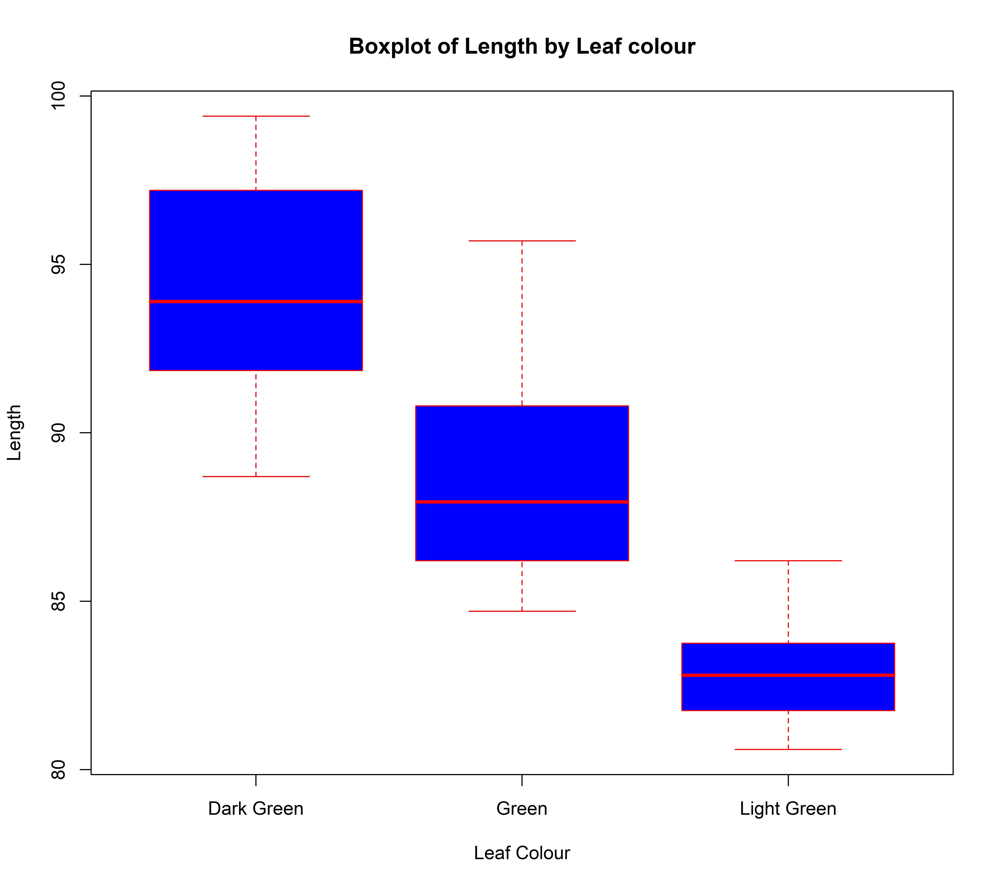

# 🌾 Plant Genotype Phenotypic Analysis in R

> **Measuring 100 plant genotypes and turning trait data into selection decisions** 
> a step-by-step R workflow, from first look at the data to a live decision easy visuals.

*Abiotic Stress Breeder · Trait Selection · Reproducible Pipelines*

[Overview](#-dataset-overview) · [Modules](#-project-modules) · [Workflow](#-workflow-pipeline)

---

## 📊 Dataset Overview

Phenotypic data recorded for **100 plant genotypes** (`G1` – `G100`).
Each genotype is described by one ID and five measured/scored traits:

### 📋 Recorded Variables

| Variable | What it means |
|:---:|---|
| `Genotype` **Genotype ID** | Unique code given to each plant line (`G1` – `G100`) |
| `L` **Length** | Total plant length (height), base to tip in **cm** |
| `B` **Breadth** | Canopy width at its widest point in **cm** |
| `SL` **Shoot Length** | Length of the above-ground shoot in **cm** |
| `RL` **Root Length** | Length of the primary root system in **cm** |
| `LC` **Leaf Colour** | Visual score: *Light Green · Green · Dark Green* |

> 💡 **Field note:** `SL` and `RL` are the standard abbreviations used in seedling-vigor
> research, and `LC` is typically scored against a **Leaf Colour Chart (LCC)** 
> a simple, visual standard developed by IRRI.

---

## 🗂️ Project Modules

Five numbered scripts runnig them in order, each one builds on the previous data.

| SR | Project name | Script name | What it does (in plain words) | Packages |
|:-:|--------|--------|-------------------------------|----------|
| 1 | **Exploratory Data Analysis** | [`exploratory_data_analysis`] | summary stats, correlations, bar & scatter plots | `readxl` `dplyr` `ggplot2` |
| 2 | **ANOVA & Post-Hoc Test** | [`anova_and_posthoc`] | Checks if genotypes truly differ (One-Way ANOVA) and ranks them (Duncan's Test); exports `.png` boxplots | `agricolae` |
| 3 | **Linear Regression** | [`linear_regression`] | Predicts one trait from another, reports R² and residual offsets diagnostics | `stats` `ggplot2` |
| 4 | **Clustering & PCA** | [`genotype_clustering_pca`] | Scales traits (Z-score), groups similar genotypes (K-Means, K = 3), visualizes with PCA biplots | `factoextra` `stats` |
| 5 | **Shiny Dashboard** | [`shiny_dashboard`] | A web app to filter and plot traits — no coding needed to explore | `shiny` `dplyr` `ggplot2` |

### ❓ The Question Each Step Answers

| Step | Question |
|:---:|---|
|  `1` | *What does my data look like?* |
|  `2` | *Are the genotypes really different and which ones are the best?* |
|  `3` | *Can one trait predict another?* *(indirect selection)* |
|  `4` | *Which genotypes are alike and which are diverse enough for crossing?* |
|  `5` | *Can I explore the results without writing code?* |

---

## 🔁 Workflow Pipeline

---
## 📈 Project Results & Showcase

### 2️⃣ Statistical Comparison of Leaf Colour Groups (ANOVA & Duncan's Test)

**Script:** [`02_anova_and_posthoc.R`](./results/2_anova_and_posthoc.R)

**Description:**

This module tests whether phenotypic traits (`L`, `B`, `SL`, `RL`) differ significantly across the three **Leaf Colour (`LC`)** groups — **Light Green, Green, Dark Green** using **One-Way ANOVA**, followed by **Duncan's Multiple Range Test** to rank the groups. Final output is a **publication ready boxplot** exported at 600 dpi.

---

#### 📊 Results & Outputs

##### One-Way ANOVA —> All Traits vs. Leaf Colour

*Shows:* Whether leaf colour has a statistically significant effect on each trait (`α = 0.05`)

**📄 Full Report:** [Download the complete ANOVA & Duncan's Test output (PDF)](./results/anova_posthoc_analysis.pdf.pdf)

| Trait | Df (LC) | Df (Residuals) | Mean Sq | F value | Pr(>F) | Signif. |
|---|:-:|:-:|:-:|:-:|:-:|:-:|
| `L` | 2 | 97 | 913.60 | 107.5 | < 2e-16 | `***` |
| `B` | 2 | 97 | 23.20 | 89.4 | < 2e-16 | `***` |
| `SL` | 2 | 97 | 576.00 | 112.0 | < 2e-16 | `***` |
| `RL` | 2 | 97 | 151.74 | 114.3 | < 2e-16 | `***` |

`Signif. codes: 0 '***' 0.001 '**' 0.01 '*' 0.05 '.' 0.1 ' ' 1`

**Key Findings:**

- Leaf colour has a **highly significant effect (p < 0.001)** on every measured trait
- Strongest group separation observed for **Root Length** (F = 114.3) and **Shoot Length** (F = 112.0)

---

##### Duncan's Multiple Range Test —> Group Means & Letters

*Shows:* Mean of each leaf colour group per trait, with significance groupings

| Leaf Colour | n (r) | `L` (cm) | `B` (cm) | `SL` (cm) | `RL` (cm) |
|---|:-:|:-:|:-:|:-:|:-:|
| **Dark Green** | 40 | 94.27 a | 9.11 a | 66.07 a | 29.60 a |
| **Green** | 40 | 88.65 b | 8.15 b | 61.65 b | 27.30 b |
| **Light Green** | 20 | 82.82 c | 7.31 c | 56.96 c | 24.93 c |

*Means sharing the same letter are **not** significantly different (α = 0.05).*

**Key Findings:**

- **Perfect ranking on all traits:** Dark Green > Green > Light Green — every trait
- All three groups form **separate letter groups (a / b / c)** — no overlap anywhere
- Dark Green lines outperform Light Green lines by **~14% in Length** and **~19% in Root Length**

---

##### Publication-Ready Boxplot

*Shows:* Distribution of plant Length (`L`) across the three leaf colour groups (600 dpi PNG)

**Interpretation:**

- Clear vertical separation of groups of medians step down from Dark → Light Green
- Narrow boxes (low SD: 1.4 – 3.2) indicate **consistent performance within groups**
- No genotype in Light Green reaches even the lower quartile of Dark Green

---

#### 🔍 Key Insights from Project 2:

1. **Significant leaf colour effect:** All four traits differed significantly among the three leaf colour groups (p < 0.001), confirming that leaf colour is associated with overall plant growth.
2. **Consistent performance ranking:** Mean values declined stepwise from Dark Green → Green → Light Green for every trait, and Duncan's test placed each group into a separate significance class (a / b / c).
3. **Field relevance:** Dark Green genotypes recorded ~14% greater plant length and ~19% greater root length than Light Green genotypes, supporting leaf colour as a simple, low-cost visual indicator of plant vigour during field screening.
4. **Experimental design note:** Replication was unequal across groups (Dark = 40, Green = 40, Light = 20); this unbalanced design should be stated in the methodology.
5. **Basis for further analysis:** These confirmed group differences provide the statistical foundation for trait relationship modelling (Project 3) and multivariate genotype clustering (Project 4).
---
---

**Data → Code → Decision → Results**

*Research Repeat & Reproduce.*
